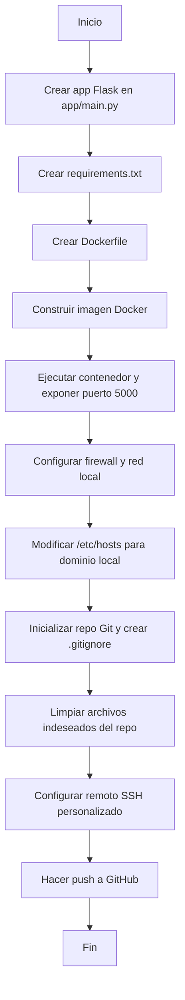

# docker-simple-app

Aplicación HTTP sencilla en Docker usando Flask y Python

## Temas tratados

- **Creación de una app Flask básica**
  - Estructura mínima en `app/main.py`.
  - Instalación de dependencias con `requirements.txt`.

- **Dockerización de la aplicación**
  - Creación de un `Dockerfile` funcional.
  - Construcción y ejecución de la imagen Docker.
  - Exposición del puerto 5000 para acceso externo.

- **Exposición en red local**
  - Configuración de firewall y puertos para permitir acceso desde otros dispositivos en la red local.

- **Configuración de dominio local**
  - Modificación de `/etc/hosts` para acceder a la app mediante `dockerapp.local`.
  - Instrucciones para replicar la configuración en otros dispositivos de la red.

- **Control de versiones y exclusión de archivos**
  - Inicialización de repositorio Git.
  - Creación de `.gitignore` para excluir `.venv`, `venv`, `__pycache__`, `.env`, `.idea`, `.vscode`, y archivos temporales.
  - Limpieza del repositorio para eliminar archivos subidos por error.

- **Subida a GitHub**
  - Configuración de remoto con host SSH personalizado.
  - Push de la rama master asegurando que no se suban archivos innecesarios.

## Uso rápido

```bash
# Construir la imagen
sudo docker build -t docker-simple-app .

# Ejecutar el contenedor
sudo docker run -d -p 5000:5000 docker-simple-app
```

Accede desde tu navegador a `http://dockerapp.local:5000` (tras configurar `/etc/hosts`).

---

<details>
<summary>Ver diagrama del proceso (Mermaid)</summary>



</details>

> Proyecto creado para fines didácticos y de práctica con Docker, Flask y Git.
